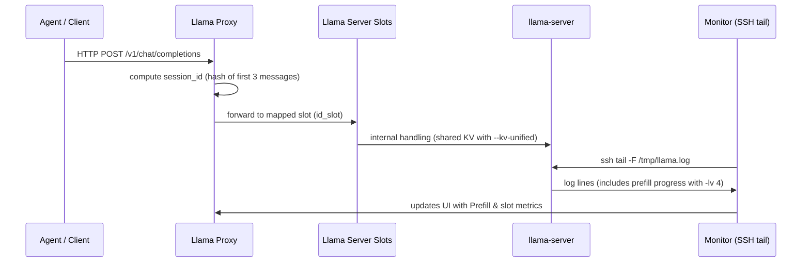

# Hermes Llama Proxy — Session → Slot

A small, focused proxy that routes OpenAI-compatible chat completion requests to a llama.cpp-based server (llama-server) while providing session affinity (session → slot), cost-aware eviction, and a monitor that extracts Prefill/progress lines from the server log.

This file contains the English documentation. For Chinese documentation see `README.md` (language selector in the main README).

---

## Overview

The proxy computes a stable session ID from the first three messages of a conversation and binds that session ID to a fixed llama-server slot. Repeated requests for the same session are forwarded to the same slot so that the server can reuse its internal KV cache and avoid unnecessary recomputation.

Key properties:
- Session affinity (session → slot) to preserve per-slot KV cache.
- Cost-aware eviction: prefer evicting short/cheap contexts and preserve long/expensive histories.
- Stable session hashing: first 3 messages (role + full-text) are hashed to avoid truncation collisions.
- Robust handling of cancellations and client disconnects to prevent slot state corruption.
- Prefill monitoring: monitor tails remote llama-server logs via SSH and extracts progress lines (requires verbose server logs).

Important: This proxy is agent-agnostic. Any client or agent that issues OpenAI-compatible chat completion HTTP requests can use the proxy.

---

## Requirements

- Python 3.8+ (aiohttp, yaml, rich, requests)
- A running `llama-server` (llama.cpp server) reachable from the proxy.
- For Prefill progress monitoring:
  - Start `llama-server` with verbose logging level `-lv 4`.
  - Redirect the server stdout/stderr to a log file and make it accessible via SSH from the machine running the monitor.

When using `--kv-unified` on the server, it is recommended to add `--cache-ram 0` to avoid silent memory-level clearing of GPU KV that can cause desyncs.

Keep the proxy `slots` value less than or equal to the `--parallel` value on the llama-server.

---

## Configuration example (config.yaml)

Place `config.yaml` in the `llama-proxy` directory. Example:

```yaml
proxy:
  host: "0.0.0.0"
  port: 8888
  slots: 4

llama_server:
  url: "http://10.0.0.20:11400"
  ssh_host: "user@10.0.0.20"
  log_path: "/tmp/llama.log"
```

- `slots` is the number of logical slots the proxy will manage. It must be <= `--parallel` used by `llama-server`.
- `ssh_host` is the SSH user and host used by the monitor to tail the remote `log_path`.

---

## Recommended llama-server startup (must include `-lv 4`)

The monitor depends on verbose logging from `llama-server` to extract prefill/progress lines. Example startup command (adjust flags and model path for your setup):

```bash
nohup ./llama-server \
  -m /path/to/your_model.gguf \
  --parallel 4 \
  --kv-unified \
  --cache-ram 0 \
  --ctx-size 65536 \
  -lv 4 \
  > /tmp/llama.log 2>&1 &
```

Notes:
- `-lv 4` enables the verbose output needed for Prefill progress extraction.
- Use `--cache-ram 0` with `--kv-unified` to prevent the server's memory-level cache from inadvertently clearing GPU KV.
- `--parallel` should be >= the `slots` configured in the proxy.

---

## Start the proxy and monitor

From the `llama-proxy` directory:

Start proxy (background helper script or direct):

```bash
./start_proxy.sh
# or
python3 proxy.py --proxy-host 0.0.0.0 --proxy-port 8888 --llama-url http://10.0.0.20:11400 --slots 4
```

Start monitor (foreground, real-time UI):

```bash
./start_monitor.sh
```

The monitor displays per-slot status, Prefill progress, live token preview, evict scores, and recent events. It uses SSH to tail the remote `llama.log` configured in `config.yaml`.

---

## API endpoints

- `POST /v1/chat/completions` — Proxy entry for chat completions (OpenAI-compatible request body).
- `GET /proxy/status` — JSON summary of slot and proxy status (used by the monitor).
- All other paths are proxied directly to the underlying llama-server (passthrough).

---

## Minimal client example (curl)

Streamed chat completion (OpenAI-compatible body):

```bash
curl -N -X POST "http://localhost:8888/v1/chat/completions" \
  -H "Content-Type: application/json" \
  -d '{
    "messages": [
      {"role": "system", "content": "You are a helpful assistant."},
      {"role": "user", "content": "Write a short poem about coffee."}
    ],
    "stream": true,
    "cache_prompt": true
  }'
```

Integration notes for agents:
- Point your agent's model endpoint to the proxy URL instead of the direct llama-server.
- Keep the request shape compatible with OpenAI Chat Completions (messages array).
- Optionally include a stable `user` field or deterministic system prompt to help session hashing and source detection.

---

## Architecture (sequence diagram)

The monitor tails the remote server log via SSH and extracts Prefill/progress lines for near real-time display.



---

## Troubleshooting

- Prefill shows `waiting...` but model returns fast:
  - Fast responses may not emit the verbose prefill log lines. Inspect `proxy.log` and the remote `llama.log` for parsing errors or missing lines.
- Unexpected slot eviction / context loss:
  - Verify `--cache-ram 0` with `--kv-unified`. Check `/proxy/status` for `evict_score` and adjust `slots` or server `--parallel` accordingly.
- Session mismatch due to varying system prompts:
  - Avoid ephemeral metadata or timestamps in system prompts. Use deterministic system prompts or provide a stable `user` field.

---

If you want a tailored integration example (Discord bot, Web UI, CLI, etc.), tell me which agent and I will provide a concrete request and configuration snippet for that agent type.