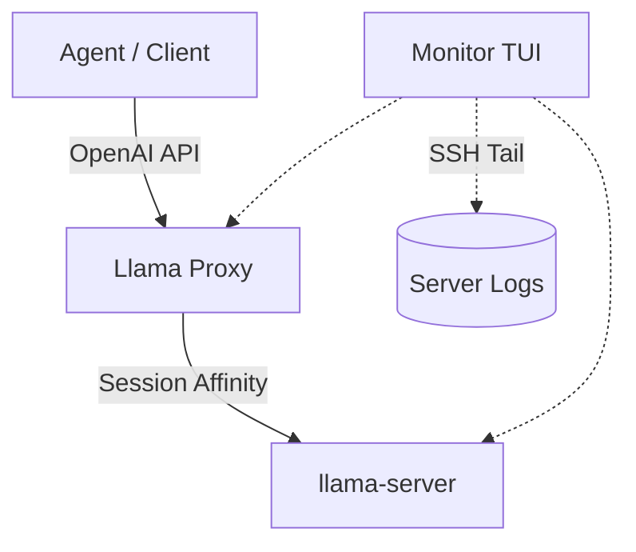

# Llama Proxy — Session → Slot



---

[English](#english) | [中文](#chinese)

---

<a name="english"></a>
## English

### Overview
A compact session-to-slot proxy that forwards OpenAI-compatible chat completion requests to a `llama-server`. The proxy binds a stable session ID to a slot so per-slot KV cache can be reused. It includes a cost-aware eviction policy and a **real-time Monitor TUI** that provides deep visibility into the inference process by tailing remote logs.

### Key features
- 🔗 **Session affinity**: Hashing the first 3 messages ensures the same conversation reuses the same slot.
- 🧠 **Cost-aware eviction**: Protects long/expensive contexts from being evicted prematurely.
- 📊 **Enhanced Monitor TUI**:
    - **Real-time Speed**: Calculates and displays `T/s` (Tokens per second) for both Prefill and Decoding.
    - **Live Token Stream**: Displays a rolling 80-character buffer of the actual generated text for each active slot.
    - **Progress Tracking**: Displays `n_tokens`, `n_decoded`, and `n_remaining` extracted from remote logs.
- 🛡️ **Robust handling**: Graceful handling of client disconnects and automatic reconnection for log monitoring.

### Requirements
- Python 3.8+ (`aiohttp`, `pyyaml`, `rich`, `requests`).
- `llama-server` started with verbose logs (`-lv 4`) for monitoring features.
- SSH access to the llama-server host for the Monitor.

### Example configuration (`config.yaml`)
```yaml
proxy:
  host: "0.0.0.0"
  port: 8888
  slots: 4

llama_server:
  url: "http://10.0.0.20:11400"
  ssh_host: "user@10.0.0.20"
  log_path: "/home/user/llama.log"
```

### Log Maintenance (Crucial)
Since `llama-server` with `-lv 4` generates massive logs (GBs per day), it is highly recommended to use `logrotate` on the server host.

**Recommended `/etc/logrotate.d/llama-server` configuration:**
```text
/home/user/llama.log {
    su user user
    size 100M
    copytruncate
    rotate 3
    compress
    missingok
    notifempty
}
```
*Note: Use `copytruncate` so the server process doesn't need to be restarted.*

---

<a name="chinese"></a>
## 中文

### 概述
本代理将符合 OpenAI 格式的请求转发至 `llama-server`。它通过将会话 ID 绑定到固定槽位来复用 KV 缓存。项目内置了成本感知驱逐策略，以及一个功能强大的 **TUI 监控终端**。

### 核心特性
- 🔗 **会话亲和**：基于前 3 条消息哈希生成 ID，确保同一对话复用同一槽位。
- 🧠 **成本感知驱逐**：优先保护长文本和重算成本高的会话。
- 📊 **增强型监控终端 (Monitor)**：
    - **实时测速**：自动计算并显示 Prefill 和 Decoding 阶段的 `T/s` (Token/秒)。
    - **滚动预览**：实时抓取并显示每个槽位正在生成的文本流（80 字符滚动缓冲区）。
    - **进度详情**：解析远程日志显示 `n_tokens` (总数), `n_decoded` (已生成) 和 `n_remaining` (剩余)。
- 🛡️ **高可用**：采集线程具备自动重连机制，能够应对网络波动和日志轮替。

### 推荐的服务端启动命令
必须包含 `-lv 4` 以供监控程序提取进度和文本：
```bash
nohup ./llama-server \
  -m /path/to/model.gguf \
  --parallel 4 \
  --kv-unified \
  -lv 4 \
  > /home/krsz/llama.log 2>&1 &
```

### 日志维护建议
由于 `-lv 4` 日志增长极快，建议在服务端配置 `logrotate`：
1. **安装**：`sudo pacman -S logrotate` (Arch) 或 `sudo apt install logrotate` (Ubuntu)。
2. **配置**：在 `/etc/logrotate.d/llama-server` 中添加配置。
3. **关键点**：务必使用 `copytruncate` 指令，这样无需重启 `llama-server` 进程即可清空日志文件并释放空间。

### 启动方式
```bash
./start_proxy.sh    # 启动代理
./start_monitor.sh  # 启动监控界面
```
监控界面现在分为两个主要部分：顶部的 **槽位资源分配表**（包含 Waitlist 状态）和底部的 **实时事件面板**（显示进度、速度和滚动文本）。